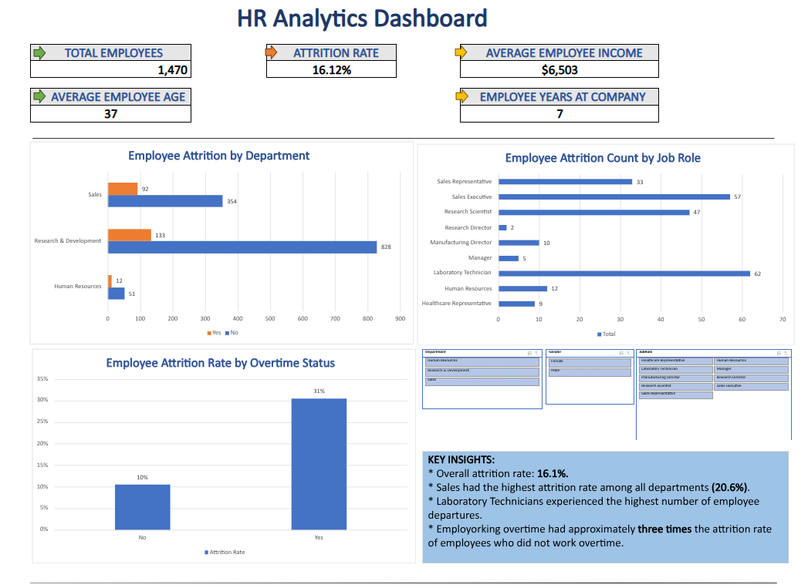

# HR-Analytics-Dashboard

## Project Overview
This project analyzes employee attrition using Microsoft Excel to identify workforce trends and provide HR insights through an interactive dashboard. The dashboard summarizes key metrics, visualizes attrition patterns, and allows users to filter results using slicers. 

## Dashboard Features
-Interactive dashboard with slicers
-KPI cards
-PivotTables and PivotCharts
-Employee attrition analysis
-Department and job role comparisons
-Overtime attrition analysis

## Key Metrics
-Total Employees
-Attrition Rate
-Average Employee Age
-Average Monthly Income
-Average Years at Company

## Key Findings
-Overall employee attrition rate: **16.1%**
-Sales had the highest attrition rate among all departments (**20.6%**).
-Laboratory Technicians experienced the highest number of employee departures.
-Employees working overtime had approximately **three times** the attrition rate of employees who did not work overtime.  

## Tools Used
-Microsoft Excel
-PivotTables
-PivotCharts
-Slicers
-Excel Formulas
-Dashboard Design

## Dataset
IBM HR Analytics Employee Attrition & Performance Dataset (Kaggle)

## Files
- 'HR_Analytics_Dashboard.xlsx' - Interactive Excel dashboard
- 'Dashboard.png' - Dashboard preview

